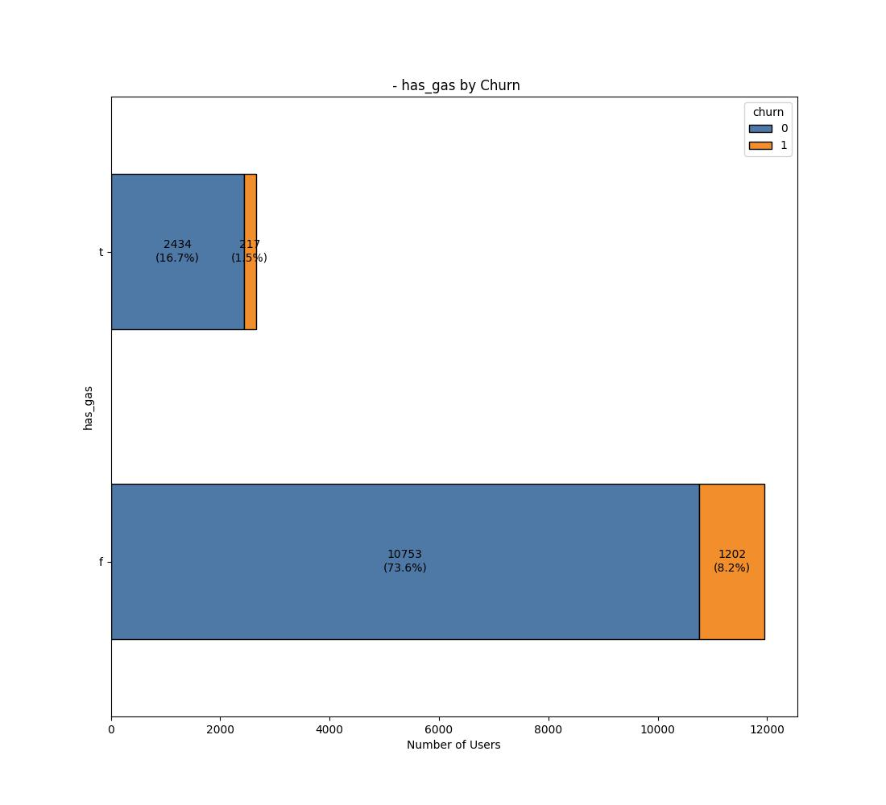

# Use Case: Exploratory Data Analysis (EDA) for PowerCo's Customer Churn Rate
---

**Overview**:
This project focuses on conducting an Exploratory Data Analysis (EDA) for PowerCo, an electric company aiming to analyze and reduce its customer churn rate. The insights gained from this EDA will help PowerCo understand the factors contributing to customer churn and develop strategies to improve customer retention.

**Objective:** 
To analyze QVI Chips sales data using Python to identify key performance indicators, understand customer behavior, and inform marketing and product strategies.

**Dataset:**
The datasets contains anonymized customer data, including demographic information, account details, and service usage metrics. The features in the datasets include:

**client_df**

id = client company identifier

activity_new = category of the company’s activity 

channel_sales = code of the sales

channelcons_12m = electricity consumption of the past 12 months

cons_gas_12m = gas consumption of the past 12 months

cons_last_month = electricity consumption of the last month

date_activ = date of activation of the contract

date_end = registered date of the end of the contract

date_modif_prod = date of the last modification of the product

date_renewal = date of the next contract renewal

forecast_cons_12m = forecasted electricity consumption for next 12 months

forecast_cons_year = forecasted electricity consumption for the next calendar year

forecast_discount_energy = forecasted value of current discount

forecast_meter_rent_12m = forecasted bill of meter rental for the next 2 months

forecast_price_energy_off_peak = forecasted energy price for 1st period (off peak)

forecast_price_energy_peak = forecasted energy price for 2nd period (peak)

forecast_price_pow_off_peak = forecasted power price for 1st period (off peak)

has_gas = indicated if client is also a gas client imp_cons = current paid consumption

margin_gross_pow_ele = gross margin on power subscription

margin_net_pow_ele = net margin on power subscription

nb_prod_act = number of active products and services

net_margin = total net marginnum_years_antig = antiquity of the client (in number of years)

origin_up = code of the electricity campaign the customer first subscribed.

pow_max = subscribed power *churn = has the client churned over the next 3 months


**price_df**

id = client company identifier

price_date = reference date

price_off_peak_var = price of energy for the 1st period (off peak)

price_peak_var = price of energy for the 2nd period (peak)

price_mid_peak_var = price of energy for the 3rd period (mid peak)

price_off_peak_fix = price of power for the 1st period (off peak)

price_peak_fix = price of power for the 2nd period (peak)

price_mid_peak_fix = price of power for the 3rd period (mid peak)

**Steps:**
The EDA involves the following steps:
- **Data Loading**

        ```
        # Import necessary libraries
        import pandas as pd

        # Load dataset
        client_df = pd.read_csv(client_url, engine='python')
        price_df = pd.read_csv(price_url, engine='python')
        ```

.png>)

.png>)


- **Summary statistics:** Calculate summary statistics for numerical variables.
- **Data visualization:** Create visualizations to explore data distributions and relationships.
- **Plotting the categorical columns of client_df by churn rates**
  

- **Plotting the distribution of numerical columns of client_df**
.png>)

- **Plotting stacked bars of columns by churn rates**
.png>)

- **Plotting box plots of columns by churn rates**
.png>)


**Expected Outcomes:**
By the end of this analysis, we expect to:
- Understand the main factors driving customer churn at PowerCo.
- Provide actionable insights for reducing churn rates.
- Offer recommendations for future data collection and analysis.